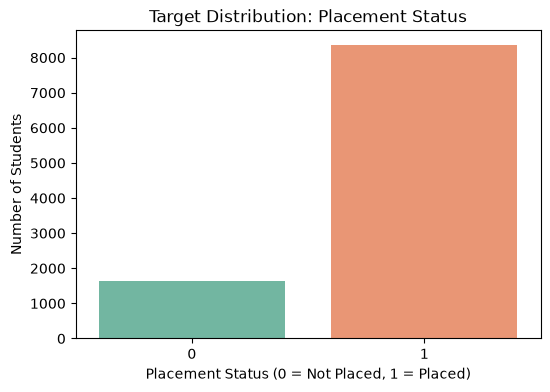
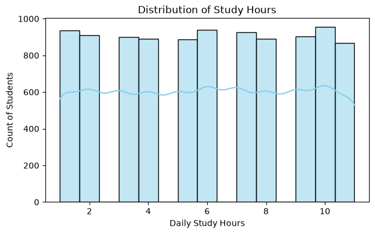
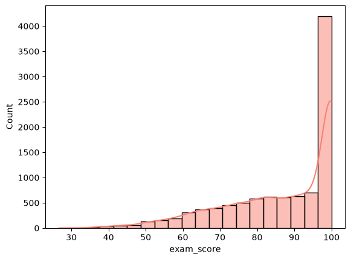
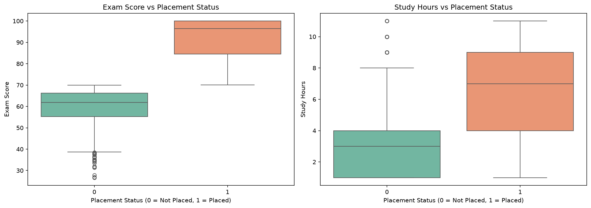
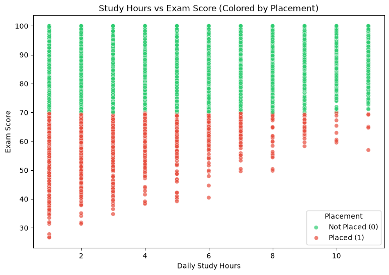
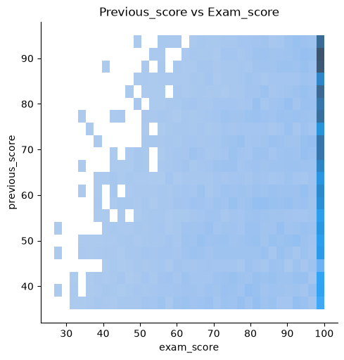
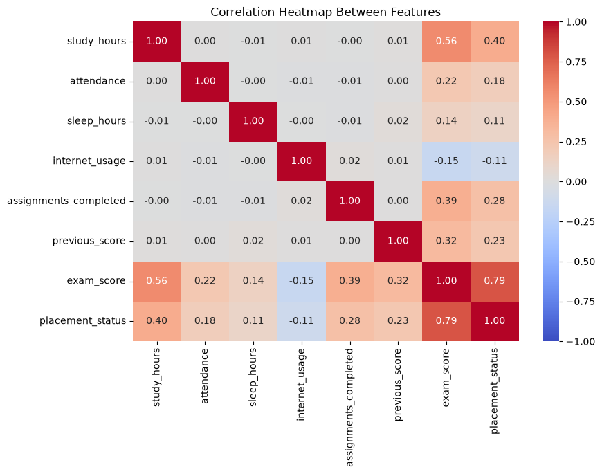
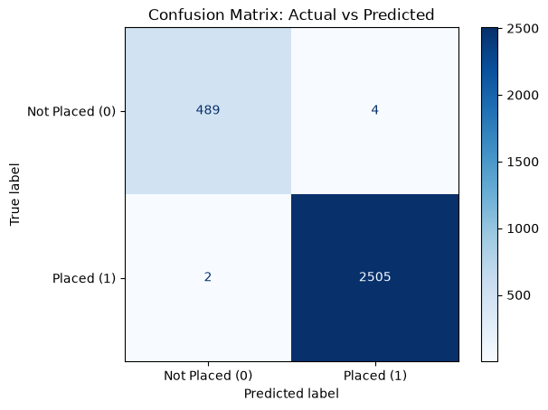
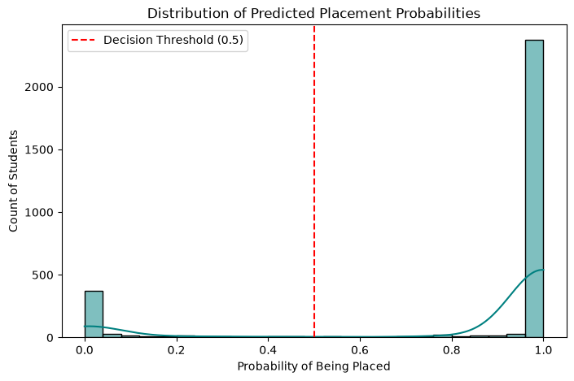
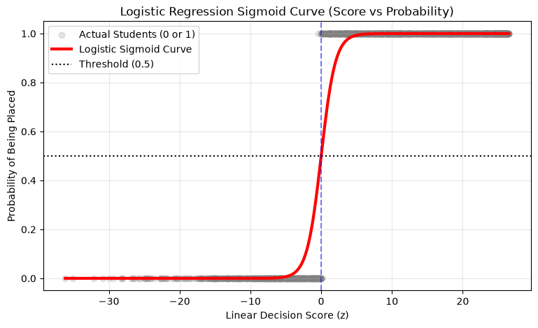

# 🎓 Student Placement Prediction

[](https://www.python.org/)
[](https://opensource.org/licenses/MIT)
[](https://scikit-learn.org/)
[](https://pandas.pydata.org/)
[](https://numpy.org/)
[](#-model-evaluation--performance)
[](#-model-evaluation--performance)

An end-to-end Machine Learning classification project designed to predict student campus placement outcomes (`Placed` vs. `Not Placed`) based on academic performance, study habits, and lifestyle metrics.

---

## 📌 Table of Contents

- [Overview & Objectives](#-overview--objectives)
- [Dataset Architecture](#-dataset-architecture)
- [Key Exploratory Findings (EDA)](#-key-exploratory-findings-eda)
- [Data Preprocessing Pipeline](#-data-preprocessing-pipeline)
- [Model Training & Mathematical Formulation](#-model-training--mathematical-formulation)
- [Model Evaluation & Performance](#-model-evaluation--performance)
- [Feature Importance & Weights](#-feature-importance--weights)
- [Interactive Inference Engine](#-interactive-inference-engine)
- [Project Directory Structure](#-project-directory-structure)
- [Installation & Getting Started](#-installation--getting-started)
- [Contributing & License](#-contributing--license)

---

## 🚀 Overview & Objectives

In academic and professional institutions, **placement** represents a student securing career employment or industry internships prior to or upon graduation. Predicting placement outcomes early provides critical intervention opportunities for educators to support at-risk students and optimize curriculum strategies.

### Project Goals:
1. **Analyze Academic Behaviors**: Uncover the relationship between daily study habits, attendance, rest, and exam outcomes.
2. **Handle Data Imbalance & Leakage**: Clean and stratify 10,000 real-world simulated records without data leakage.
3. **Train an Interpretable Classifier**: Develop a calibrated `LogisticRegression` classification model with high precision and recall.
4. **Deploy an Inference Tool**: Provide a standalone prediction function capable of evaluating any new student profile instantly.

---

## 📊 Dataset Architecture

The project analyzes [`student_dataset_10000_rows.csv`](student_dataset_10000_rows.csv), comprising **10,000 student records** and 8 primary features:

| Feature Name | Data Type | Units / Range | Description |
| :--- | :--- | :--- | :--- |
| `study_hours` | Integer | 1 – 12+ hrs | Average daily study hours dedicated by the student |
| `attendance` | Integer | 0 – 100 % | Percentage of academic classes attended |
| `sleep_hours` | Integer | 4 – 10+ hrs | Average nightly hours of sleep |
| `internet_usage` | Integer | 0 – 15+ hrs | Daily recreational/leisure internet browsing hours |
| `assignments_completed` | Integer | 0 – 20+ | Total coursework assignments submitted |
| `previous_score` | Integer | 0 – 100 | Baseline performance / historical academic score |
| `exam_score` | Float | 0.0 – 100.0 | Final semester examination score |
| **`placement_status`** | Categorical | `Placed` / `Not Placed` | **Target Variable**: Binary placement outcome |

### Target Class Distribution:
- **Placed (`1`)**: 8,356 students (83.56%)
- **Not Placed (`0`)**: 1,644 students (16.44%)
- *Class balance ratio*: ~5:1 (handled using stratified splitting during model training).

<p align="center">
  
</p>

---

## 🔍 Key Exploratory Findings (EDA)

Comprehensive exploratory data analysis was conducted across univariate, bivariate, and multivariate relationships:

### 1. Feature Distributions
- **Daily Study Hours**: Normally distributed around 6–8 hours daily, reflecting balanced student habits across the cohort.
- **Final Exam Scores**: Skewed heavily to the right towards high performance, with a notable ceiling cluster at a perfect 100.0 score.

<p align="center">
  
  
</p>

---

### 2. Bivariate Analysis & Class Separation
- **Boxplot Separation**: The boxplot comparison reveals near-zero overlap between `Placed` and `Not Placed` cohorts on `exam_score`. Placed students consistently maintain an exam score above 70, while non-placed students remain below 60.
- **Study Hours Impact**: Placed students consistently invest significantly more daily study hours than their non-placed peers.

<p align="center">
  
</p>

---

### 3. Study Hours vs Exam Score Interaction
Visualizing students along both `study_hours` and `exam_score` with color-coded placement markers highlights a clear classification boundary:
- Green markers (`Placed`) dominate the upper-right quadrant.
- Red markers (`Not Placed`) cluster tightly at the lower range of exam scores.

<p align="center">
  
</p>

---

### 4. Historical Consistency & Correlation Matrix
A diagonal bivariate distribution between `previous_score` and `exam_score` demonstrates that academic consistency holds over time: students with strong prior foundation consistently excel in finals.

<p align="center">
  
  
</p>

#### Core Correlation Highlights:
- **`exam_score` vs `study_hours`**: **`+0.56`** (Strong positive driver)
- **`exam_score` vs `assignments_completed`**: **`+0.39`** (Consistent positive driver)
- **`exam_score` vs `previous_score`**: **`+0.32`** (Baseline indicator)
- **`exam_score` vs `attendance`**: **`+0.22`** (Moderate positive correlation)
- **`exam_score` vs `internet_usage`**: **`-0.15`** (Inverse relationship with excessive recreational browsing)

---

## ⚙️ Data Preprocessing Pipeline

To ensure the classifier generalizes accurately without risk of data contamination or leakage:

1. **Integrity Validation**:
   - Duplicates check: **0 duplicates** detected across all 10,000 records.
   - Missing values check: **0 null / NaN values** present across all fields.
2. **Target Label Encoding**:
   - `Placed` $\rightarrow$ `1`
   - `Not Placed` $\rightarrow$ `0`
3. **Stratified Train-Test Splitting**:
   - Ratio: **70% Training (7,000 samples)** / **30% Testing (3,000 samples)**
   - `stratify=y`: Preserves exact 83.56% : 16.44% class ratios in both splits.
   - `random_state=42`: Guaranteed deterministic reproducibility.
4. **Feature Standardization (`StandardScaler`)**:
   - Zero-mean, unit-variance scaling:
     $$z_i = \frac{x_i - \mu_{\text{train}}}{\sigma_{\text{train}}}$$
   - **Crucial Best Practice**: Fitted exclusively on `X_train` (`scaler.fit_transform`) and applied to `X_test` (`scaler.transform`) to prevent data leakage.

---

## 🧠 Model Training & Mathematical Formulation

The problem is framed as binary classification solved via **Logistic Regression**:

### Mathematical Foundation:
1. **Linear Combination (Logits / Decision Score)**:
   $$z = w_0 + \sum_{j=1}^{n} w_j X_j$$
2. **Sigmoid Activation Function**:
   $$\sigma(z) = P(Y=1 \mid X) = \frac{1}{1 + e^{-z}}$$
3. **Decision Rule**:
   $$\hat{y} = \begin{cases} 1 & \text{if } P(Y=1 \mid X) \ge 0.5 \quad (z \ge 0) \\ 0 & \text{if } P(Y=1 \mid X) < 0.5 \quad (z < 0) \end{cases}$$

### Learned Parameters:
- **Model Intercept (Bias, $w_0$)**: `+14.2004`

---

## 📈 Feature Importance & Weights

Because all inputs were standardized using `StandardScaler`, the resulting coefficients ($w_j$) directly indicate the relative importance and directional effect of each feature on the probability of placement:

| Rank | Feature | Standardized Weight ($w_j$) | Directional Impact | Interpretation |
| :---: | :--- | :---: | :---: | :--- |
| **1** | **`exam_score`** | **`+12.2848`** | 🟢 Extremely Positive | Overwhelmingly the primary determining factor for placement |
| **2** | **`study_hours`** | **`+0.3655`** | 🟢 Positive | Higher daily study hours boost placement odds |
| **3** | **`assignments_completed`** | **`+0.2401`** | 🟢 Positive | Coursework completion increases subject mastery |
| **4** | **`attendance`** | **`+0.2149`** | 🟢 Positive | Regular classroom presence improves outcomes |
| **5** | **`previous_score`** | **`+0.1540`** | 🟢 Positive | Prior academic performance forms a strong foundation |
| **6** | **`sleep_hours`** | **`+0.1292`** | 🟢 Positive | Healthy rest contributes to sustained cognitive focus |
| **7** | **`internet_usage`** | **`-0.1229`** | 🔴 Negative | Excessive leisure screen time negatively impacts placement |

---

## 🎯 Model Evaluation & Performance

The model was tested against **3,000 unseen students** in the test set.

### Quantitative Metrics:

| Metric | Score | Performance Level |
| :--- | :---: | :--- |
| **Accuracy** | **99.80%** (`0.9980`) | 2,994 / 3,000 correct predictions |
| **Precision** | **99.84%** (`0.9984`) | Minimal false alarms |
| **Recall** | **99.92%** (`0.9992`) | Catches 99.92% of all placed candidates |
| **F1-Score** | **99.88%** (`0.9988`) | Harmonic mean showing balance across classes |

### Classification Report:
```text
              precision    recall  f1-score   support

           0       1.00      0.99      0.99       493
           1       1.00      1.00      1.00      2507

    accuracy                           1.00      3000
   macro avg       1.00      1.00      1.00      3000
weighted avg       1.00      1.00      1.00      3000
```

---

### Confusion Matrix Breakdown

<p align="center">
  
</p>

- **True Negatives (TN) = 489**: Correctly identified unplaced students.
- **False Positives (FP) = 4**: Students predicted placed who were not.
- **False Negatives (FN) = 2**: Students predicted unplaced who secured placement.
- **True Positives (TP) = 2505**: Correctly identified placed students.

---

### Sigmoid S-Curve & Probability Distribution
The calibrated decision boundary shows clean separation across the sigmoid activation function:

<p align="center">
  
  
</p>

- **Left (Probability Distribution)**: Confirms high model confidence; predictions cluster tightly near $P \approx 0.0$ and $P \approx 1.0$.
- **Right (Sigmoid Curve)**: Maps test linear decision scores ($z$) against true placement outcomes, demonstrating sharp logistic transition at $z = 0$.

---

## 💻 Interactive Inference Engine

The repository includes a reusable prediction function allowing testing on arbitrary student profiles:

```python
import numpy as np

def predict_new_student(study_hours, attendance, sleep_hours, internet_usage, 
                        assignments_completed, previous_score, exam_score):
    """
    Predicts placement status for an individual student using fitted scaler & model.
    """
    raw_features = np.array([[
        study_hours, attendance, sleep_hours, internet_usage,
        assignments_completed, previous_score, exam_score
    ]])
    
    # Scale input using the pre-fitted StandardScaler
    scaled_features = scaler.transform(raw_features)
    
    # Predict binary class and confidence probability
    pred_class = model.predict(scaled_features)[0]
    pred_prob = model.predict_proba(scaled_features)[0][1]
    
    status = "PLACED 🎉" if pred_class == 1 else "NOT PLACED ❌"
    
    print("=" * 45)
    print(f"Prediction Result:     {status}")
    print(f"Placement Probability: {pred_prob * 100:.2f}%")
    print("=" * 45)
```

### Demonstration:

```python
# Example 1: High engagement student
predict_new_student(
    study_hours=8, 
    attendance=85, 
    sleep_hours=7, 
    internet_usage=4, 
    assignments_completed=9, 
    previous_score=75, 
    exam_score=88.5
)
# Output:
# =============================================
# Prediction Result:     PLACED 🎉
# Placement Probability: 100.00%
# =============================================

# Example 2: Low engagement student
predict_new_student(
    study_hours=2, 
    attendance=40, 
    sleep_hours=5, 
    internet_usage=9, 
    assignments_completed=2, 
    previous_score=35, 
    exam_score=42.0
)
# Output:
# =============================================
# Prediction Result:     NOT PLACED ❌
# Placement Probability: 0.00%
# =============================================
```

---

## 📁 Project Directory Structure

```text
Student_Placement_Prediction/
│
├── assets/                                 # Visualizations & charts extracted from notebook
│   ├── boxplots_placement.png              # Exam score & study hours boxplots
│   ├── confusion_matrix.png                # Heatmap confusion matrix display
│   ├── correlation_heatmap.png             # Feature correlation matrix
│   ├── displot_exam_previous.png           # Bivariate distribution plot
│   ├── exam_score_distribution.png         # Histogram of final exam scores
│   ├── probability_distribution.png        # Distribution of predicted probabilities
│   ├── scatterplot_study_exam.png          # Scatterplot colored by placement
│   ├── sigmoid_curve.png                   # Logistic regression sigmoid S-curve
│   ├── study_hours_distribution.png        # Histogram of study hours
│   └── target_distribution.png             # Target class count distribution
│
├── student_dataset_10000_rows.csv          # Full dataset (10,000 rows × 8 columns)
├── student_performance.ipynb               # Complete Jupyter Notebook (EDA, Modeling, Eval)
├── requirements.txt                        # Python dependencies
└── README.md                               # Project documentation & summary
```

---

## 🛠️ Installation & Getting Started

### 1. Clone the Repository
```bash
git clone https://github.com/Melchizedek-Madaki/Placement-Prediction.git
cd Placement-Prediction
```

### 2. Set Up a Virtual Environment (Optional but Recommended)
```bash
# On Windows
python -m venv venv
venv\Scripts\activate

# On macOS/Linux
python3 -m venv venv
source venv/bin/activate
```

### 3. Install Dependencies
```bash
pip install -r requirements.txt
```

### 4. Launch Jupyter Notebook
```bash
jupyter notebook student_performance.ipynb
# or run with VS Code / Jupyter Lab
```

---

## 🤝 Contributing & License

Contributions, issues, and feature requests are welcome! Feel free to open an issue or submit a pull request.

This project is licensed under the [MIT License](LICENSE).

---

<p align="center">
  Developed by <a href="https://github.com/Melchizedek-Madaki"><b>Melchizedek Madaki</b></a>
</p>
